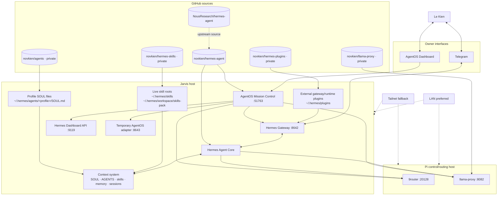
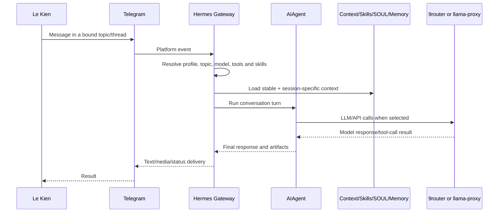
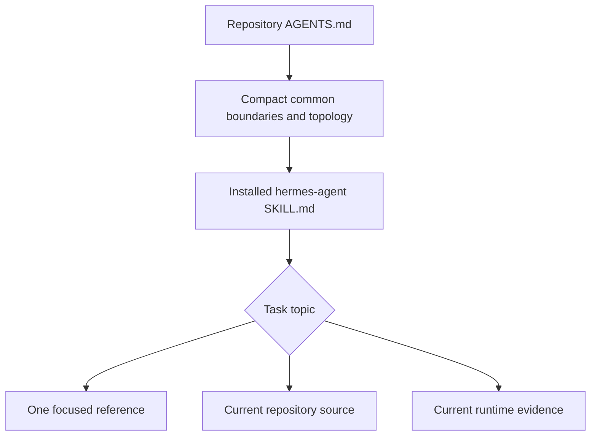

# Jarvis/Hermes Agent System

`novkien/hermes-agent` is the application fork at the center of Le Kien's distributed
Jarvis/Hermes agent system.

This repository contains the Hermes application runtime. The complete system also
includes Telegram and browser control surfaces, an external AgentOS adapter, separate
LLM routing services, a private shared-skills registry, a private gateway-plugin
registry, a private profile-SOUL registry, profile-selectable skill packs, and the
CEO/Manager/Worker multi-agent hierarchy.

> **Base project:** Hermes Agent by Nous Research. This fork retains the upstream
> application architecture while adding Jarvis-owned instruction layers, runtime
> integrations, profiles, routing, and operational workflows.

Windows users can install from PowerShell with `scripts/install.ps1`; the full
platform-specific setup and update guidance lives in `website/docs/user-guide/windows-native.md`.

## System objective

Jarvis/Hermes is designed as an owner-directed multi-agent operating environment:

- Le Kien interacts primarily through Telegram.
- Hermes coordinates CEO, Manager, Worker, Skill Lab, System Prompt Lab, Bridge, and
  specialist roles.
- AgentOS provides a browser control and observability plane for the wider system.
- 9router and llama-proxy provide separate LLM/API routing paths.
- Shared skills/profile packs, external gateway plugins, and profile `SOUL.md` files
  are maintained in separate canonical repositories.
- Repository state, deployed bytes, cache/session refresh, and observed behavior are
  separate evidence layers.
- LAN is the preferred network path; Tailnet is the resilient fallback for distributed
  hosts and LAN failure.

## Topology



GitHub arrows above express **source ownership**, not automatic deployment. A commit in
a canonical repository does not prove the corresponding runtime bytes were deployed or
loaded by a running session.

## Component inventory

| Component | Responsibility | Current source/deployment evidence |
|---|---|---|
| Hermes Agent | Agent loop, tools, gateway, profiles, sessions, memory, plugin/skills integration and user interfaces | [`novkien/hermes-agent`](https://github.com/novkien/hermes-agent); deployed checkout normally `/home/jarvis/.hermes/hermes-agent` |
| Telegram gateway | Primary owner conversation channel and thread/topic routing | `gateway/` plus Telegram platform implementation in this repository |
| AgentOS Mission Control | Browser BFF/control plane for system state, health, governance, chat, events and proxy surfaces | Native `apps/mission-control/` application in this repository; independent `hermes-mission-control.service` on the Jarvis/Hermes host |
| AgentOS external adapter | Temporary external API for AgentOS-owned access to Hermes data surfaces and bounded supported mutations | External Jarvis-host service; remains separate until a future owner-authorized merge changes that boundary |
| 9router | General model/provider router | External project on the Pi |
| llama-proxy | OpenAI-compatible local-model router, model lifecycle controller, dashboard and ComfyUI passthrough | [`novkien/llama-proxy`](https://github.com/novkien/llama-proxy); deployed on the Pi |
| Hermes skills registry | Canonical Git source for shared skills and profile-selectable skill packs | Private [`novkien/hermes-skills`](https://github.com/novkien/hermes-skills) |
| Hermes plugin registry | Canonical Git source for owner-managed gateway/runtime plugin packages | Private [`novkien/hermes-plugins`](https://github.com/novkien/hermes-plugins); deployed packages live under `/home/jarvis/.hermes/plugins/` |
| Agent SOUL registry | Canonical reviewed Git source for profile `SOUL.md` definitions | Private [`novkien/agents`](https://github.com/novkien/agents); deployed files live under `/home/jarvis/.hermes/agents/<profile>/SOUL.md` |
| Upstream Hermes | Base application project | [`NousResearch/hermes-agent`](https://github.com/NousResearch/hermes-agent) |

## Canonical behavior-source boundaries

Hermes behavior is intentionally split across several repositories rather than treating
the application fork as a monolith:

```text
novkien/hermes-agent
  → executable Hermes application, gateway, plugin framework, tools and integrations

novkien/hermes-skills
  → shared skills, focused references and profile-selectable skill packs

novkien/hermes-plugins
  → owner-managed external gateway/runtime plugin packages

novkien/agents
  → reviewed <profile>/SOUL.md definitions
```

These sources are complementary:

- `hermes-agent/plugins/` is the application plugin framework and bundled/built-in
  plugin surface. It is **not** the canonical repository for the owner's external
  plugin packages.
- `hermes-skills` owns reusable skills and profile skill packs. It does **not** own the
  canonical profile `SOUL.md` files.
- `agents` tracks reviewed `SOUL.md` definitions; profile import code and runtime
  configuration remain separate unless explicitly added to that repository.
- `hermes-plugins` tracks plugin source packages; plugin runtime data and mutable state
  remain outside the repository.

## Current network convention

The owner-declared current Pi LAN route is:

```text
pi@192.168.1.140
```

LAN is preferred while hosts are on the same network. Tailnet addressing must remain
available as an independent fallback. Exact Tailnet IPs are deliberately kept out of
this public repository because they are volatile deployment facts; resolve them from
current Tailscale state or the private system-context skill.

Historical `192.168.0.x` values are not automatic fallbacks. Reverify before use.

## Primary interaction flow



Telegram is the primary owner conversation surface. AgentOS is an additional browser
control plane and chat surface; it does not replace the Telegram routing contract.

## Multi-agent execution topology

The core responsibility chain is:

```text
Le Kien
  → CEO: mission intake, planning, routing, recovery, integration and terminal return
      → Level-2 Manager: domain ownership, decomposition, supervision and evidence assessment
          → Kanban Worker(s): substantive specialist execution
```

Governance destinations such as Skill Lab and System Prompt Lab are separate A2A
surfaces rather than ordinary Kanban workers. A2A messaging is used for inter-agent
coordination and mission handoff; native Kanban is the durable execution backbone for
Manager-dispatched Worker work.

The exact active role contracts live in the private instruction sources and current
runtime context. This README describes the topology, not every behavioral rule.

## AgentOS control plane

AgentOS Mission Control is a native application in this repository under
`apps/mission-control/`. It runs on the Jarvis/Hermes host as an independent
`hermes-mission-control.service` process alongside `hermes-gateway.service`:

```text
AgentOS browser
  → Mission Control on Jarvis/Hermes :51763
      → Hermes Dashboard API :9119
      → Hermes Gateway API :8642
      → temporary external AgentOS adapter :8643
      → direct/proxied 9router dashboard/API on Pi
      → direct/proxied llama-proxy dashboard/API on Pi
```

The gateway unit uses only `Wants=hermes-mission-control.service`. There is no
`Requires=`, `PartOf=` or `BindsTo=` relationship. Consequently, Mission Control has
its own PID, cgroup, logs and restart policy; restarting or stopping it does not affect
the gateway. Gateway start/restart issues an idempotent Mission Control start, so an
already-running dashboard keeps its PID.

The BFF keeps bounded allowlists for upstream reads and supported mutation surfaces.
The external adapter remains a separate transitional component until a later explicit
owner-authorized merge. The old Pi checkout/service is retired only by a separate
post-merge deployment and cleanup operation with runtime evidence.

## LLM routing

Jarvis/Hermes has two distinct routing surfaces:

### 9router

- General custom-provider/model routing path.
- Used by Hermes model and auxiliary model configuration where selected.
- Runs on the Pi and exposes its own dashboard/API surface.
- Remains an external project; current implementation facts must be verified from its
  source/service before modification.

### llama-proxy

- OpenAI-compatible local-model endpoint.
- Routes public model aliases to remote/local llama-server services.
- Controls wake, availability, model switching, idle unload and shutdown behavior.
- Provides model/chat and dashboard surfaces according to current proxy source.
- Canonical sanitized source is stored in private `novkien/llama-proxy`.

9router and llama-proxy are sibling routing paths, not mandatory serial stages. A
configured URL is not proof that a service is active. Runtime state must be checked
from current listeners, service state, and safe health/model-list requests.

## Context system

The context architecture uses progressive disclosure:



### Roles of each layer

| Layer | Purpose |
|---|---|
| `AGENTS.md` | Compact repository-wide owner authority, scope boundary, topology and routing instructions |
| `README.md` | Human-readable system overview and topology |
| `hermes-agent/SKILL.md` | Broad private Jarvis/Hermes context authority and reference router |
| Profile `SOUL.md` | Profile-specific behavioral/identity instruction layer, canonically reviewed in `novkien/agents` |
| Shared skills/profile packs | Reusable procedures and profile-selectable capability context from `novkien/hermes-skills` |
| External plugins | Runtime/gateway extension packages from `novkien/hermes-plugins` |
| Current source | Authoritative for present implementation in the repository being discussed |
| Current runtime evidence | Authoritative for deployed paths, services, bindings and observed behavior |

The system distinguishes stable design from volatile facts. IPs, ports, models,
branches, SHAs, service state, topic bindings, deployed plugin/SOUL bytes, and active
skill versions must be reverified instead of silently trusted from an old document.

## Skills and profile packs

The live skill estate is intentionally split:

```text
~/.hermes/skills/                    # shared installation skills
~/.hermes/workspace/skills-pack/     # profile-selectable packs
```

Hermes discovers the shared skill root and configured external pack directories. Topic
and profile configuration may further preload or allowlist specific skills. Inventory
counts and exact pack/profile bindings are volatile and should be read from the current
private registry/runtime state rather than frozen into this overview.

### Canonical skills Git workflow

The private repository maps directly to the existing runtime skill paths:

| Git path | Runtime path |
|---|---|
| `skills/` | `/home/jarvis/.hermes/skills/` |
| `workspace/skills-pack/` | `/home/jarvis/.hermes/workspace/skills-pack/` |

Normal repository-tracked skill work uses a branch and pull request. After an
authorized merge, Bridge deploys the selected `master` commit using:

```bash
git \
  --git-dir=/home/jarvis/.hermes/repos/hermes-skills.git \
  --work-tree=/home/jarvis/.hermes \
  pull --ff-only origin master
```

The linked worktree must be clean and the update must be a fast-forward. Bridge must
not repair divergence with reset, clean, stash, merge, rebase, or force-push.

For Git-tracked skill paths, this workflow supersedes apply-ZIP unless the owner
explicitly chooses apply-ZIP for a particular operation. A pull deploys files only;
`/reload-skills`, session reset, service reload, and behavioral validation are separate
facts/actions.

## Plugin and profile-SOUL source workflow

The two additional owner repositories are canonical reviewed source planes:

```text
novkien/hermes-plugins
  → /home/jarvis/.hermes/plugins/<plugin>/

novkien/agents
  → /home/jarvis/.hermes/agents/<profile>/SOUL.md
```

Use the current repository branch/PR workflow for source changes. Do not infer an
automatic deployment path from the GitHub repository alone. When deployment is part of
a task, separately verify the exact runtime write/pull/sync operation, live-byte
readback, required reload/reset, and behavior.

## Source-change boundary

Primary ChatGPT and agents may inspect this repository to understand current behavior.
They may not modify executable source from a general or ambiguous request.

```text
General request about behavior/context/prompt/skill/SOUL
  → instruction-layer target by default

Explicit request to change a named code/runtime/plugin/service/dashboard surface
  → executable work authorized for that scope
```

Once a target is selected, write it in its owning repository rather than collapsing
all behavior into `hermes-agent`:

```text
application/runtime documentation or code → novkien/hermes-agent
shared skill/profile pack                 → novkien/hermes-skills
external gateway/runtime plugin           → novkien/hermes-plugins
profile SOUL.md                            → novkien/agents
AgentOS Mission Control                    → novkien/hermes-agent/apps/mission-control
llama-proxy                                → novkien/llama-proxy
```

This boundary prevents an instruction request from drifting into an unrequested code
redesign while still allowing exact owner-authorized executable changes.

## Repository structure

```text
hermes-agent/
├── run_agent.py          # core AIAgent orchestration
├── agent/                # prompt, providers, memory, compression, skills
├── model_tools.py        # tool-call orchestration
├── toolsets.py           # toolset definitions
├── tools/                # tool implementations and registry
├── gateway/              # messaging gateway runtime
├── apps/mission-control/ # native AgentOS BFF/control-plane application
├── plugins/              # plugin framework and bundled/built-in plugin surface
├── hermes_cli/           # commands, setup, profiles, web server
├── cli.py                # classic CLI
├── ui-tui/               # Ink/React terminal UI
├── tui_gateway/          # JSON-RPC backend
├── cron/                 # scheduled work
├── skills/               # bundled seed skills
├── optional-skills/      # optional seed skills
├── tests/                # automated tests
└── website/              # product documentation
```

See [`AGENTS.md`](AGENTS.md) for working rules and the private `hermes-agent` skill for
deep deployment context.

## Evidence snapshot

A context survey on **2026-08-11** observed the Jarvis/Pi deployment and the original
set of application, skills, AgentOS, router, and proxy repositories. On **2026-08-13**
the owner established two additional canonical source repositories:

- `novkien/hermes-plugins` for owner-managed gateway/runtime plugin packages; and
- `novkien/agents` for profile `SOUL.md` definitions.

These dates document source-map evolution, not permanent runtime guarantees. Reverify
live hosts, listeners, bindings, active models, deployed bytes, and service state before
an operational action.

## Security and publication rules

- Never commit passwords, tokens, private keys, cookies, auth headers, live databases,
  sessions, logs, runtime state, model weights, or unreviewed backups.
- Keep exact Tailnet addressing and private thread bindings in private context sources.
- Do not assume a repository is private; verify GitHub metadata.
- Treat plugin source, SOUL files, and skills as code/instruction assets: review them for
  secret material before publication or cross-repository movement.
- Report suspected secret locations without reproducing the secret value.
- Historical credentials in Git history require rotation and a separate owner-directed
  history-remediation decision.

## Upstream and licensing

This fork is based on the Nous Research Hermes Agent project. Consult the repository's
license and upstream documentation for licensing, installation, and generic product
usage. Jarvis-specific deployment and instruction-layer behavior are governed by the
owner context documented here and in the private canonical repositories above.
